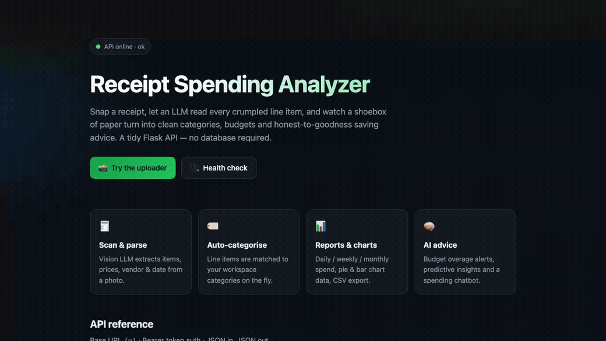
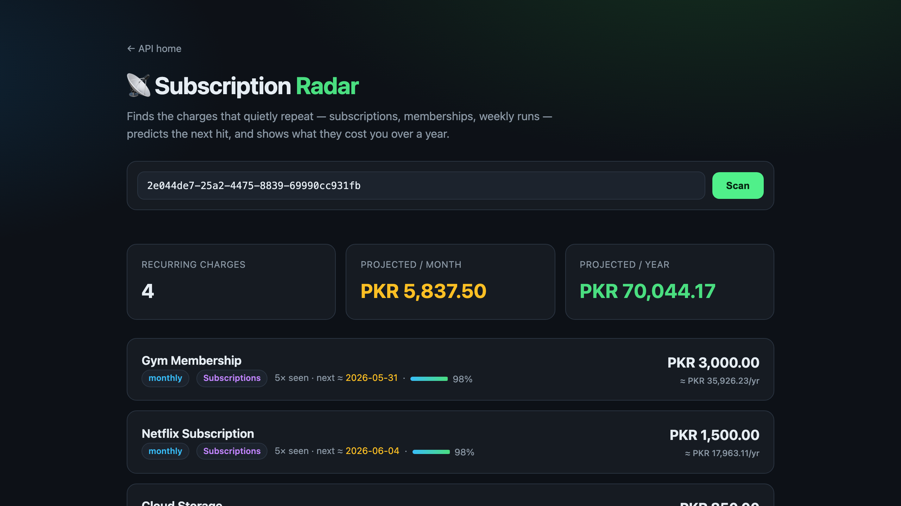
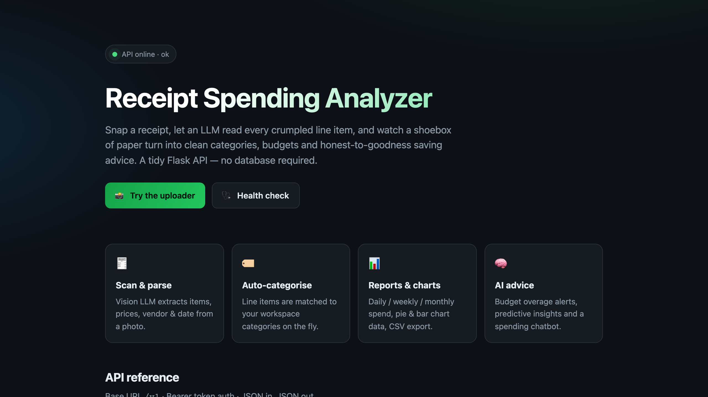
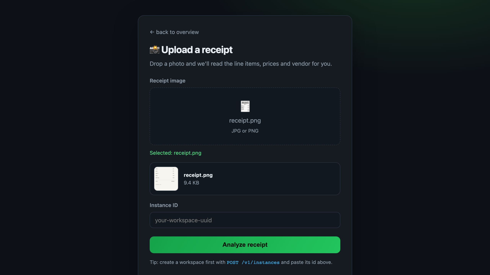
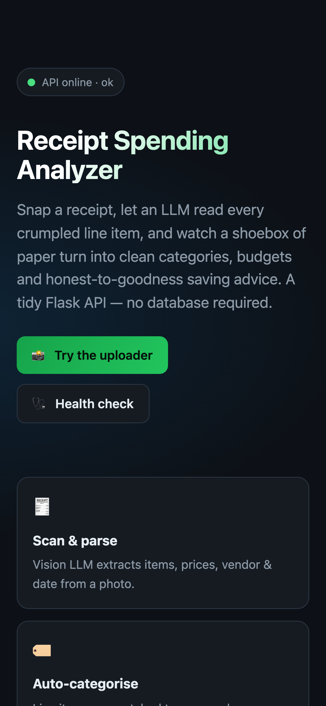

# 🧾 Receipt Spending Analyzer

<p align="center">
  <a href="#-license"></a>
  
  
  
  
  
  <a href="#-roadmap-ideas"></a>
</p>

> Snap a receipt, let an LLM read every crumpled line item, and watch a shoebox of paper
> turn into clean categories, budgets and honest-to-goodness saving advice.

A tidy little **Flask** API that does the boring part of budgeting for you. Upload a photo of a
receipt, a vision model extracts each item, price, vendor and date, matches everything to your own
spending categories, and then hands you reports, charts, budget alerts and an AI advisor that
actually knows what you bought. No database, no heavyweight setup — just CSV and JSON files on disk.

<p align="center">
  
</p>

<p align="center">
  <em>Landing page → drag-and-drop uploader → Subscription Radar catching your quiet monthly leaks.</em>
</p>

---

## 🆕 What's new

The receipts you keep are only half the story — it's the charges you *forget* that quietly drain
the account. This release goes looking for them, and adds a few creature comforts along the way:

- **📡 Subscription Radar** — brand-new recurring-charge detection. Pure maths over your CSV (no LLM,
  no key), it spots the charges that repeat — Netflix, the gym, that cloud drive — classifies the
  cadence, predicts the *next* hit, flags price creep, and totals what they cost you per month and
  per year. Ships as both a REST endpoint **and** a dark-mode dashboard at **`/recurring`**.
- **🖥️ Premium terminal dashboard** — a `rich`-powered TUI (`cli.py`) that renders workspaces,
  transactions, budget bars and an in-terminal spend breakdown without leaving your shell.
- **🧪 A/B landing test** — two heroes, one cookie. Visit `/?variant=b` for a benefit-led variant.
- **🛡️ Hardened & accessible** — uniform JSON errors, upload size caps + type checks, keyboard-first
  pages with skip links and focus rings, deferred heavy imports for a snappier cold start.
- **✅ Real test suite** — 52 pytest cases + a GitHub Actions CI workflow.
- **🔎 Discoverable & installable** — SEO/Open Graph/JSON-LD, a favicon + PWA manifest set,
  `sitemap.xml` / `robots.txt`, and `pip install -e .` packaging with a `receipt-analyzer` command.

<p align="center">
  
</p>

---

## ✨ What it does

- **🧾 Scan & parse** — a vision LLM pulls items, prices, vendor and purchase date straight from a photo.
- **🏷️ Auto-categorise** — every line item is matched to your workspace's categories, and brand-new
  categories are created on the fly when nothing fits.
- **📁 Workspaces** — keep separate budgets (personal, business, "that trip to Karachi") side by side.
- **💸 Transactions & budgets** — query spending and set per-category limits with utilisation tracking.
- **📊 Reports & charts** — daily / weekly / monthly totals, top items, top categories, plus pie / bar /
  line chart data and one-click CSV export.
- **🧠 AI insights & advice** — personalised saving suggestions, budget-overage detection and a
  conversational chatbot that answers questions about *your* spending.
- **📡 Recurring-charge detection** — spots subscriptions and repeat buys ("you've paid Netflix three
  months running"), estimates their monthly/annual burden, predicts the next charge and flags price
  creep — no LLM required, pure maths over your CSV.
- **🩺 Health check** — a plain liveness endpoint for your uptime monitor.

Everything persists to lightweight files under `storage/` — perfect for a demo, a hackathon, or a
self-hosted personal tool.

---

## 🖥️ It runs in your terminal, too

Not everything needs a browser. `cli.py` is a read-only [`rich`](https://github.com/Textualize/rich)
dashboard that talks to the running API over HTTP — browse workspaces, page through transactions,
watch budget bars fill up in colour and read a spend breakdown as an in-terminal bar chart. It
degrades to clean plain text when `rich` isn't installed, so it always runs.

<p align="center">
  
</p>

```bash
python cli.py                 # launch the interactive dashboard
python cli.py health          # one-shot API health check
python cli.py workspaces      # list workspaces as a table
python cli.py show <id>       # full dashboard for one workspace
```

Point it anywhere with `AIRECEIPT_URL`, `AIRECEIPT_TOKEN` and `AIRECEIPT_CURRENCY`. Full notes in
[`docs/VARIANTS.md`](docs/VARIANTS.md).

---

## 🏗️ How it's built

| Layer            | Choice                                             |
| ---------------- | -------------------------------------------------- |
| Web framework    | Flask 3 (blueprint-per-domain)                     |
| AI               | OpenAI (vision for parsing, chat for advice)       |
| Data crunching   | pandas over CSV / JSON files — no DB to babysit    |
| Charts           | matplotlib (headless `Agg` backend)                |
| Terminal UI      | `rich` (optional — degrades to plain text)         |
| Tests            | pytest + GitHub Actions CI                          |
| Config           | `python-dotenv` (`.env`)                           |

The code is organised so each concern lives in its own place:

```
app/
├── routes/        # thin HTTP handlers (one blueprint per area)
├── services/      # the actual business logic (incl. recurring.py)
│   └── aggregators/   # report math: items, categories, summaries
├── utils/         # LLM calls, image saving, CSV queries
└── errors.py      # uniform JSON error handlers
templates/         # landing (A/B), uploader, Subscription Radar
cli.py             # rich terminal dashboard
tests/             # pytest suite
run.py             # app factory + entry point
```

---

## 🚀 Get it running (5 minutes, promise)

**TL;DR one-liner** (clone, install, launch — macOS / Linux):

```bash
git clone https://github.com/waleedsworld/Ai-Reciept.git && cd Ai-Reciept && \
  python3 -m venv .venv && source .venv/bin/activate && pip install -e . && receipt-analyzer
```

Then open **http://127.0.0.1:5000**. Installing with `pip install -e .` (see
[`pyproject.toml`](pyproject.toml)) also drops a **`receipt-analyzer`** command on your `PATH`
that boots the server from anywhere. Prefer the step-by-step version? Read on.

### Prerequisites

- **Python 3.9+** (developed on 3.11) — check with `python3 --version`
- **pip** and the ability to make a virtual environment
- An **OpenAI API key** — *only* needed for the AI features (parsing, advice, chat). The workspace,
  category, transaction, report **and Subscription Radar** endpoints work perfectly fine without one.

### 1. Clone & enter

```bash
git clone https://github.com/waleedsworld/Ai-Reciept.git
cd Ai-Reciept
```

### 2. Create and activate a virtual environment

```bash
python3 -m venv .venv

# macOS / Linux
source .venv/bin/activate

# Windows (PowerShell)
.venv\Scripts\Activate.ps1
```

### 3. Install the dependencies

```bash
pip install -r requirements.txt
```

### 4. Add your API key

```bash
cp .env.example .env
# then open .env and paste your key:
# OPENAI_API_KEY=sk-...
```

### 5. Run it

```bash
python run.py
```

Open **http://127.0.0.1:5000** and you'll get the friendly landing page with a live API map. That's it! 🎉

> Want a different port? `PORT=8080 python run.py`.

### Kick the tyres without a key

There's a zero-dependency-on-OpenAI smoke test that creates a workspace, seeds categories and reads
them back:

```bash
python test.py
```

Or run the full suite:

```bash
pip install pytest && pytest
```

---

## 📡 API reference

Base URL is `/v1`. Auth is a bearer token (`Authorization: Bearer <token>`) — in this reference
build the token doubles as the user id, so pick any string and stay consistent.

### Workspaces
| Method | Path | Purpose |
| --- | --- | --- |
| `POST` | `/v1/instances` | Create a workspace |
| `GET` | `/v1/instances` | List your workspaces |
| `GET` | `/v1/instances/<id>` | Workspace details + total spend |
| `PUT` | `/v1/instances/<id>` | Rename / archive |
| `DELETE` | `/v1/instances/<id>` | Delete a workspace |

### Categories
| Method | Path | Purpose |
| --- | --- | --- |
| `POST` | `/v1/instances/<id>/initialize` | Bulk-seed categories (comma separated) |
| `POST` | `/v1/instances/<id>/categories` | Add one category |
| `PUT` / `POST` | `/v1/categories/<cat_id>` | Rename a category |
| `DELETE` | `/v1/categories/<cat_id>` | Delete a category |

### Receipts
| Method | Path | Purpose |
| --- | --- | --- |
| `POST` | `/v1/reciepts` | Upload an image → parsed + categorised items |
| `GET` | `/v1/reciepts/<id>` | Fetch a parsed receipt |
| `PATCH` | `/v1/reciepts/<id>` | Correct line items and re-sync the CSV |

### Transactions & budgets
| Method | Path | Purpose |
| --- | --- | --- |
| `GET` | `/v1/instances/<id>/transactions` | List transactions |
| `POST` | `/v1/instances/<id>/budgets` | Create / update a category budget |
| `GET` | `/v1/instances/<id>/budgets` | Budget utilisation (spent vs limit) |
| `GET` | `/v1/instances/<id>/recurring` | 📡 Detect recurring charges / subscriptions |

> **Subscription Radar params** (both optional): `?min_occurrences=3` — separate purchase days
> needed to qualify; `?max_variability=0.4` — how metronome-like the gaps must be (0–1, lower is
> stricter). Returns each charge's cadence, next-expected date, price trend, confidence, and the
> projected monthly / annual totals.

### Reports & insights
| Method | Path | Purpose |
| --- | --- | --- |
| `GET` | `/v1/instances/<id>/reports` | Numeric report (`?period=weekly\|monthly\|custom`) |
| `GET` | `/v1/instances/<id>/graphs` | Chart-ready data |
| `GET` | `/v1/instances/<id>/export` | Stream the raw CSV |
| `POST` | `/v1/instances/<id>/advice` | Generate saving advice |
| `POST` | `/v1/instances/<id>/chat` | Chat about your spending |
| `GET` | `/v1/health` | Liveness check |

### Try it with curl

```bash
# 1. Create a workspace
curl -X POST http://127.0.0.1:5000/v1/instances \
  -H "Authorization: Bearer me" \
  -H "Content-Type: application/json" \
  -d '{"name":"My Budget"}'

# 2. Seed some categories (use the instance_id from step 1)
curl -X POST http://127.0.0.1:5000/v1/instances/<id>/initialize \
  -H "Authorization: Bearer me" \
  -H "Content-Type: application/json" \
  -d '{"categories":"Groceries, Transport, Coffee"}'

# 3. Upload a receipt (needs OPENAI_API_KEY)
curl -X POST http://127.0.0.1:5000/v1/reciepts \
  -H "Authorization: Bearer me" \
  -F "reciept=@receipt.jpg" \
  -F "instance_id=<id>"

# 4. Sweep for subscriptions (no key needed)
curl "http://127.0.0.1:5000/v1/instances/<id>/recurring?min_occurrences=3"
```

Prefer clicking? Head to **/upload** for a drag-and-drop uploader that shows the parsed JSON inline,
or **/recurring** for the Subscription Radar dashboard.

---

## 📸 A look around

<p align="center">
  
</p>

<p align="center">
  
  &nbsp;
  
</p>

---

## 🌐 Live demo

Live demo — deploying soon.

---

## 🧪 Extras

- **📡 Subscription Radar dashboard** — a self-contained dark UI at `/recurring` over the
  recurring-charge API. Paste an instance id, hit **Scan**, and watch your quiet monthly leaks
  light up.
- **🖥️ Terminal dashboard** — `python cli.py show <id>` for a full `rich` TUI. See
  [`docs/VARIANTS.md`](docs/VARIANTS.md).
- **🧪 Landing A/B test** — visit `/?variant=b` for an alternate benefit-led hero (the choice sticks
  via a cookie). Details in [`docs/VARIANTS.md`](docs/VARIANTS.md).

---

## 🗺️ Roadmap ideas

- Swap CSV storage for SQLite when a workspace gets big.
- Multi-currency support (totals currently assume PKR).
- ~~Recurring-charge detection ("you've paid Netflix 3 months running").~~ ✅ **Shipped** —
  `GET /v1/instances/<id>/recurring` + the `/recurring` dashboard.
- Push Subscription Radar findings into budget alerts automatically.

---

## 📜 License

MIT — use it, fork it, expense it. Attribution appreciated.
